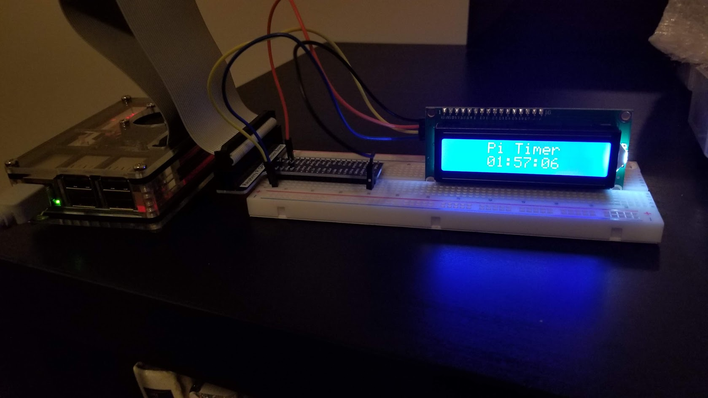
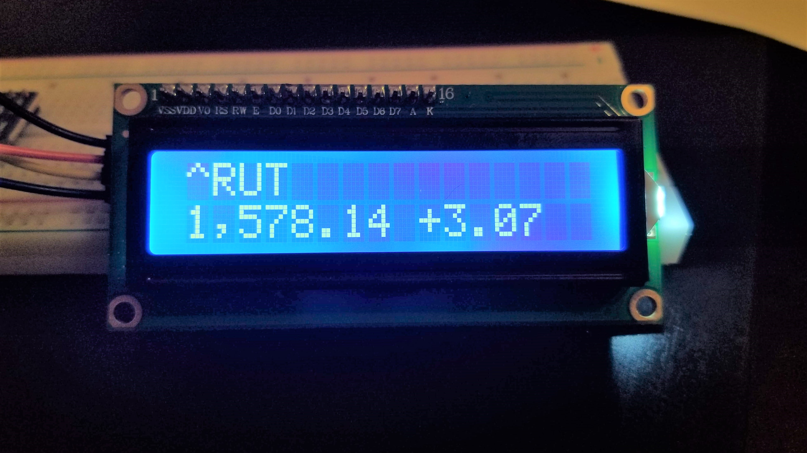

# Raspberry-Pi-LCD-1602
 Several projects using the LCD1602 on the Raspberry Pi

## (1) Initial Setup
Instructions for setting up your Raspberry Pi to accept the LCD1602, as well as hooking up your LCD1602 and running a test program  

## (2) End of the World Timer
You should be prepared for the end... you can be with this Raspberry Pi **End of the World** timer.

## (3) Weather Clock
Coming soon... 

## (4) News Headline Scroller
Coming soon...

## (5) Stock Ticker
Build a live updated stock ticker that pulls stocks or indexes of your choice from Yahoo! Finance.

## (6) Live Sports Scores
Coming soon...

## (7) LCD Ship Game
Coming soon...

