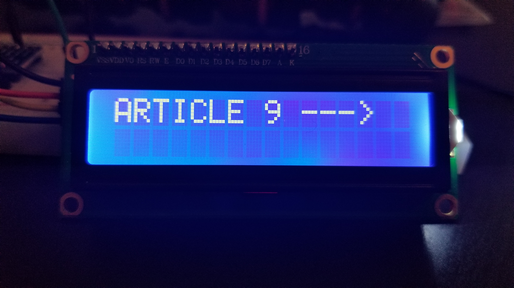
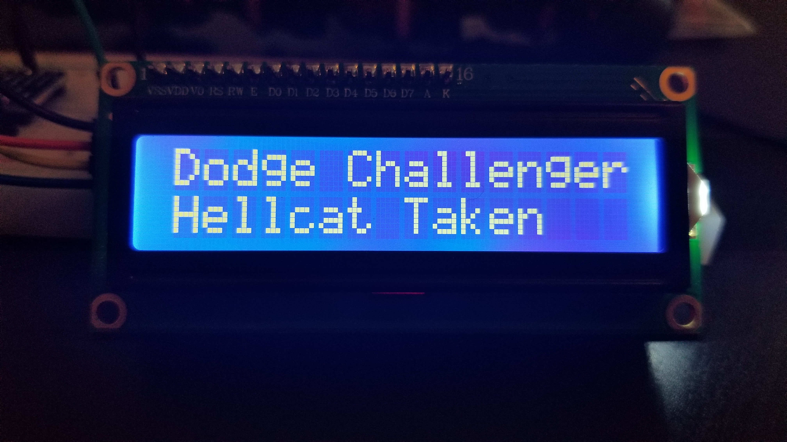

# Raspberry-Pi-LCD-1602
 Several projects using the LCD1602 on the Raspberry Pi

## (1) Initial Setup
Instructions for setting up your Raspberry Pi to accept the LCD1602, as well as hooking up your LCD1602 and running a test program  

## (2) End of the World Timer
Are you prepared for the **END OF THE WORLD**?? With this timer... you can be (JUST A JOKE... .OBVIOUSLY)  
[Download the code](02-Timer/lcd_timer.py) to get started.

## (3) Weather Clock
Coming soon... 

## (4) News Headline Scroller
Get streaming top headlines with the NewsAPI to your Raspberry Pi. Still a work in progress. But here are some screen shots of what I have so far.
You will need to get setup with a NewsAPI key if you haven't already. It's not hard. [Here's a video](https://youtu.be/oUuIVJ96JsI) on how to get started with NewsAPI.

## (5) Stock Ticker
Build a live updated stock ticker that pulls stocks or indexes of your choice from Yahoo! Finance.

## (6) Live Sports Scores
Coming soon...

